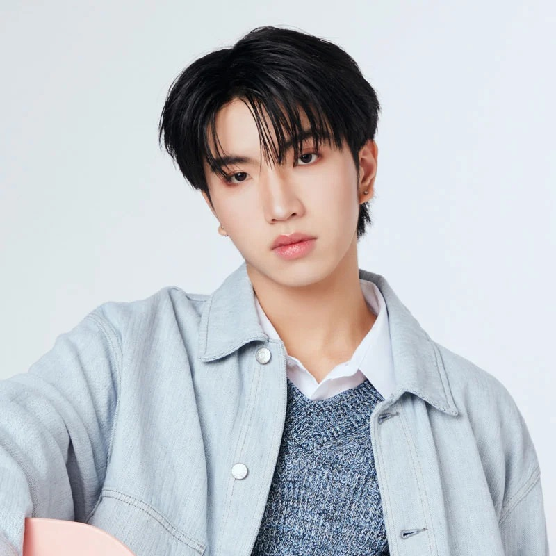

# Profile

<h2 align="center">SEA</h2>


{% column width="41.66666666666667%" %}
<figure><figcaption></figcaption></figure>


{% column width="58.33333333333333%" %}
SEA : Dechchart Tasilp\
ซี : เดชชาติ ทาศิลป์\
Date of Birth : 3 May 2005\
Weight : 60 kg. / Height  : 183 cm.\
Hashtag : [#sea\_ta\_lay](https://x.com/hashtag/sea_ta_lay?src=hashtag_click)

Contact for Work\
Call: (+66)61-414-4046 (GMMTV)\
Line OA : @gmmtvartists\_work\
Email : gmmtv.artists@gmail.com

    



***

<h2 align="center">KEEN</h2>


{% column width="41.66666666666667%" %}
<figure><figcaption></figcaption></figure>


{% column width="58.33333333333333%" %}
KEEN : Suvijak Piyanopharoj\
คีน : สุวิจักขณ์ ปิยะนพโรจน์\
Date of Birth : 18 August 2005\
Weight : 65 kg. / Height  : 178 cm.\
Hashtag : [#keenkeno](https://x.com/hashtag/keenkeno?src=hashtag_click)

Contact for Work\
Call : (+66)61-414-4046 (GMMTV)\
Line OA : @gmmtvartists\_work\
Email : gmmtv.artists@gmail.com

    



***

<h2 align="center">NONG NOOONG</h2>


{% column width="41.66666666666667%" %}
<figure><figcaption></figcaption></figure>


{% column width="58.33333333333333%" %}
NONG NOOONG - น้องนุ่ง 🦦🦞

Date of Birth : 15 September 2024\
Parent : อากู๋ (Sea) อาเฮีย (Keen)\
Hashtag : [#NONGNOOONG](https://x.com/hashtag/NONGNOOONG?src=hashtag_click)

🔗 [HI NONG NOOONG](https://x.com/GMMTV/status/1839532922497286569)\
🔗 [MY IDEAL FAN | เปิดตัวคาแรกเตอร์แฟนคลับของซีคีน](https://youtu.be/dB0P5NqAlM4)\
🔗 [เจออากู๋กับอาเฮียครั้งแรกฮับ💙🧡](https://x.com/NONG_NOOONG/status/1951608037690753172)

Contact for Work\
Call : (+66)61-414-4046\
Line OA : @gmmtvartists\_work\
Email : gmmtv.artists@gmail.com

      <a href="https://www.tiktok.com/@gigglegang.gmmtv" class="button primary" data-icon="tiktok">Giggle Gang</a>


