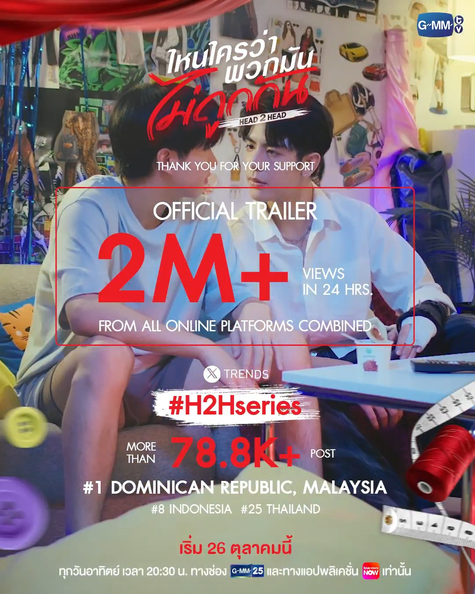
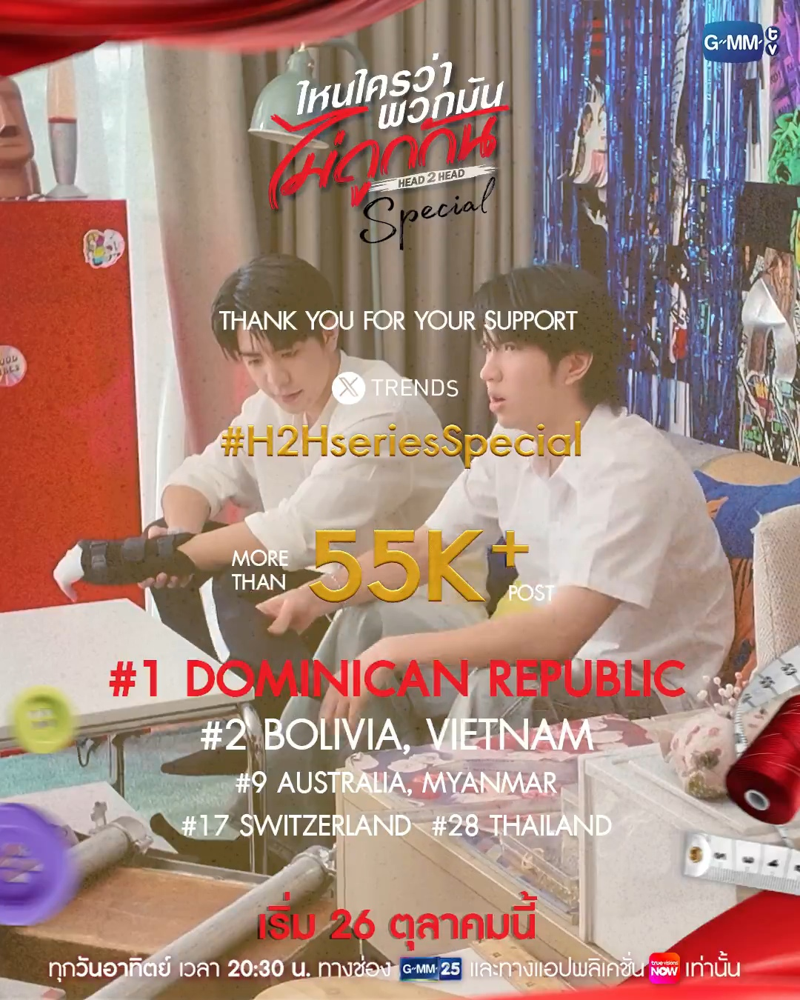
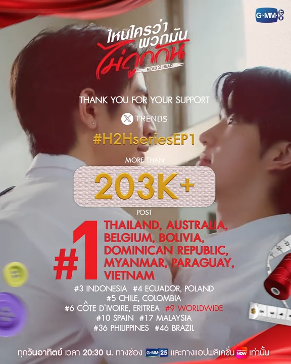
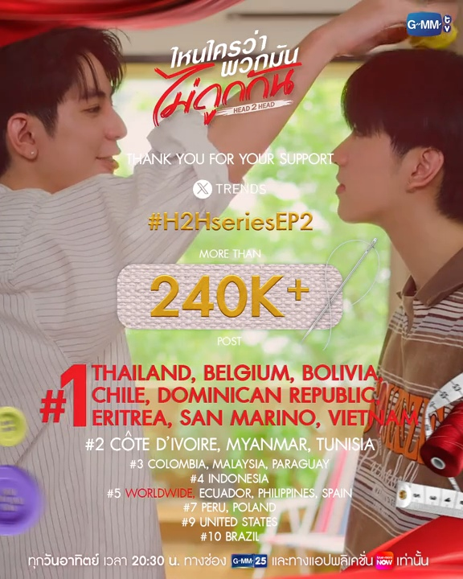
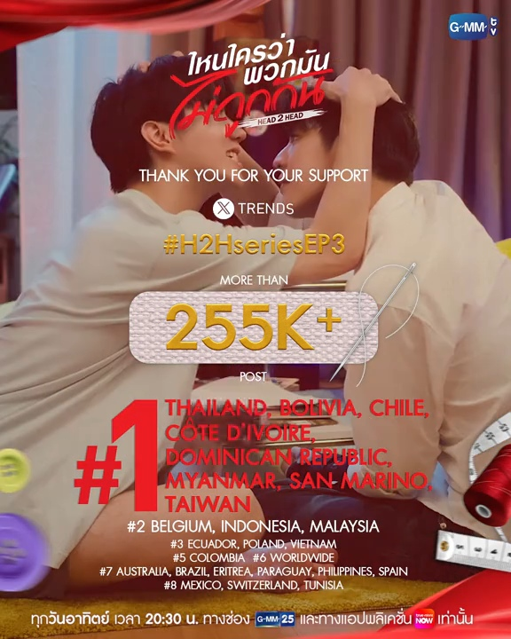
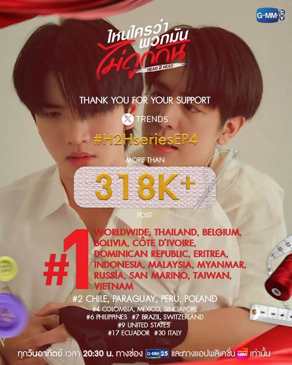
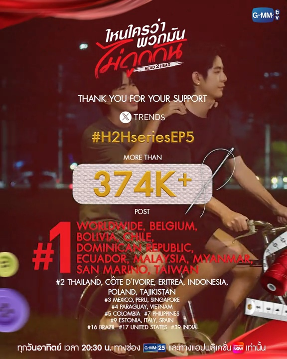
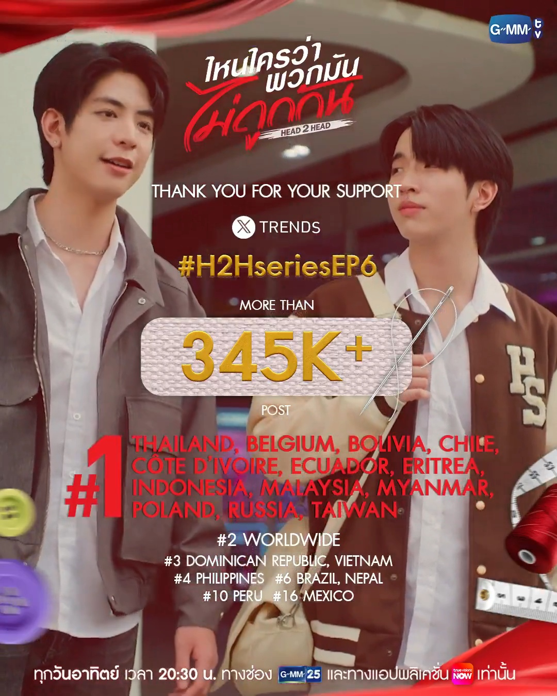
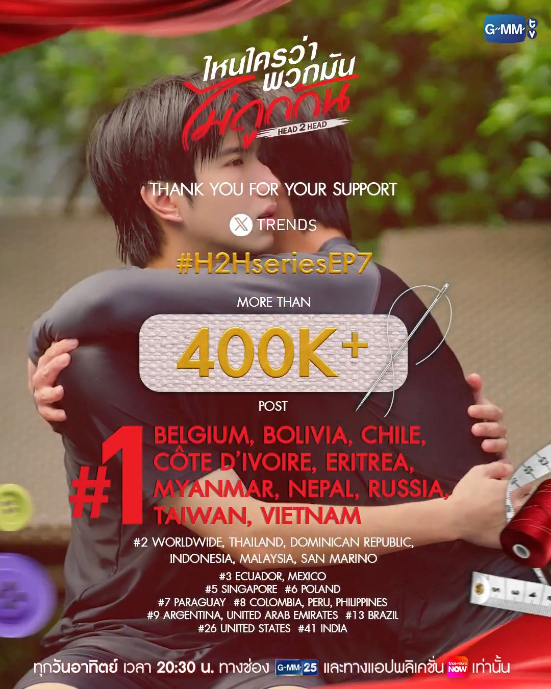

# Head 2 Head

### Storyline 

ความสัมพันธ์ของคู่อริ เจโรม (ซี เดชชาติ)  และ จิณณ์ (คีน สุวิจักขณ์) ที่คนทั้งมหาวิทยาลัยเรียกกันว่า 'สองเจ'

เริ่มต้นขึ้นจากความเกลียดขี้หน้าในวัยเด็ก จนเข้ามหาวิทยาลัยก็ยังตามติดกันมาเรียนแฟชั่นดีไซน์ด้วยกันทั้งคู่ บ้านก็อยู่ตรงข้ามกัน กลุ่มเพื่อนกลุ่มเดียวกัน แถมครอบครัวยังสนิทกันอีก แต่แม้ว่าคนรอบตัวจะพยายามหาวิธีสานสัมพันธ์อย่างไร ก็ไม่เคยเกิดผล แต่เป็นเกลียดขี้หน้าชนิดที่ว่าตัวติดกันตลอดเวลา แต่จนแล้วจนรอด เบื้องบนก็เหมือนเล่นตลก เมื่อเจโรมดันฝันเห็นเหตุการณ์ในอีก 10 ปีข้างหน้า และเห็นว่าไอ้คนที่ปัจจุบันเกลียดขี้หน้ากันแทบตาย แต่สุดท้ายดันต้องกลายมาเป็นคู่ชีวิต จากแค่อยากกวนไปวัน ๆ กลับกลายเป็นความรู้สึกที่ไม่เคยคิดมาก่อน สองความสัมพันธ์ที่ถูกลิขิตมาแล้ว ต่อให้เกลียดกันมากแค่ไหน ผลักไสกันไปเท่าไหร่ แต่เชื่อเถอะที่บอกกันว่า เกลียดอะไรจะได้อย่างนั้น มันได้อย่างนั้นจริง

มาติดตามความสัมพันธ์ของคู่ปรับทั้งสองได้ใน "ไหนใครว่าพวกมันไม่ถูกกัน Head 2 Head" ทุกวันอาทิตย์ เวลา 20:30 น. ทางช่อง GMM25 และทางแอปพลิเคชั่น TrueVisions NOW เท่านั้น เริ่ม 26 ตุลาคมนี้

กำกับซีรีส์ : ศิวัจน์ สวัสดิ์มณีกุล

***

### Trailer & Highlight 







Full EP : [YouTube](https://youtube.com/playlist?list=PLszepnkojZI4HRwD1wzag844Ig0ZGT_Pl)

Highlight : [YouTube](https://youtube.com/playlist?list=PLszepnkojZI7xrJSgECYFfrvUU1awOxLZ)

Behind The Scenes : [YouTube](https://youtube.com/playlist?list=PLszepnkojZI4zW-cRbimTEctM-zEfhmMJ)

[GMMTV2025 RIDING THE WAVE](https://www.youtube.com/live/057lFJnjqi0?si=afAdc8DNc0gEvykD\&t=3625)



***

### Behind The Scenes 

<table data-view="cards"><thead><tr><th align="center"></th><th data-hidden data-card-cover data-type="image">Cover image</th><th data-hidden data-card-target data-type="content-ref"></th></tr></thead><tbody><tr><td align="center">[BTS] Head 2 Head EP.1</td><td><a href="https://img.youtube.com/vi/k1tNUx3zsRQ/maxresdefault.jpg">https://img.youtube.com/vi/k1tNUx3zsRQ/maxresdefault.jpg</a></td><td><a href="https://youtu.be/k1tNUx3zsRQ">https://youtu.be/k1tNUx3zsRQ</a></td></tr><tr><td align="center">[BTS] Head 2 Head EP.2</td><td><a href="https://img.youtube.com/vi/oL7JhpHUEww/maxresdefault.jpg">https://img.youtube.com/vi/oL7JhpHUEww/maxresdefault.jpg</a></td><td><a href="https://youtu.be/oL7JhpHUEww">https://youtu.be/oL7JhpHUEww</a></td></tr><tr><td align="center">[BTS] Head 2 Head EP.3</td><td><a href="https://img.youtube.com/vi/-_a1iJ1ldfo/maxresdefault.jpg">https://img.youtube.com/vi/-_a1iJ1ldfo/maxresdefault.jpg</a></td><td><a href="https://youtu.be/-_a1iJ1ldfo">https://youtu.be/-_a1iJ1ldfo</a></td></tr><tr><td align="center">[BTS] Head 2 Head EP.4</td><td><a href="https://img.youtube.com/vi/Vz4LLGIBxKo/maxresdefault.jpg">https://img.youtube.com/vi/Vz4LLGIBxKo/maxresdefault.jpg</a></td><td><a href="https://youtu.be/Vz4LLGIBxKo">https://youtu.be/Vz4LLGIBxKo</a></td></tr><tr><td align="center">[BTS] Head 2 Head EP.5</td><td><a href="https://img.youtube.com/vi/dP9UtraYUYs/maxresdefault.jpg">https://img.youtube.com/vi/dP9UtraYUYs/maxresdefault.jpg</a></td><td><a href="https://youtu.be/dP9UtraYUYs">https://youtu.be/dP9UtraYUYs</a></td></tr><tr><td align="center">[BTS] Head 2 Head EP.6</td><td><a href="https://img.youtube.com/vi/Htoa9SQJh7g/maxresdefault.jpg">https://img.youtube.com/vi/Htoa9SQJh7g/maxresdefault.jpg</a></td><td><a href="https://youtu.be/Htoa9SQJh7g">https://youtu.be/Htoa9SQJh7g</a></td></tr></tbody></table>

***

### Trend Twitter (X) 



<figure><figcaption></figcaption></figure>



<figure><figcaption></figcaption></figure>



<figure><figcaption></figcaption></figure>





<figure><figcaption></figcaption></figure>



<figure><figcaption></figcaption></figure>



<figure><figcaption></figcaption></figure>





<figure><figcaption></figcaption></figure>



<figure><figcaption></figcaption></figure>



<figure><figcaption></figcaption></figure>

















***

### Poster 



<figure><figcaption></figcaption></figure>



<figure><figcaption></figcaption></figure>



<figure><figcaption></figcaption></figure>



***

<a href="./#h.meunvkrc0mvx_l" class="button primary">Back To Series Page</a>

