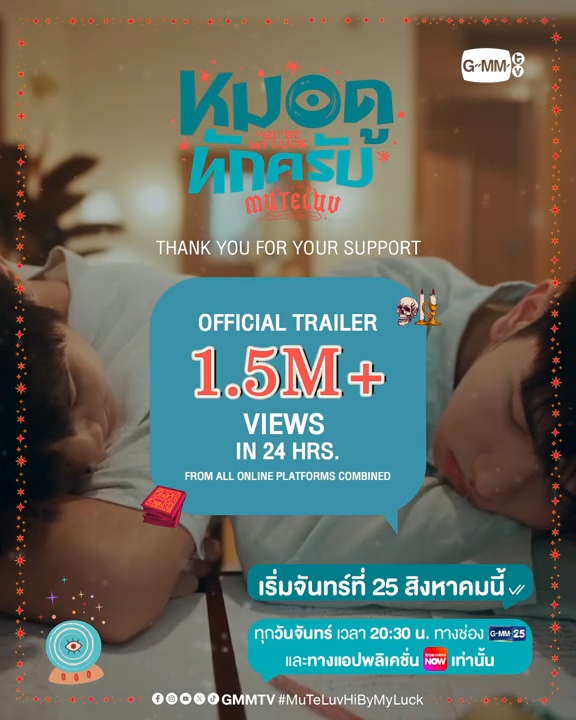

# MuTeLuv

### Storyline 

เมื่อหมอดูทักว่าความรักจะมาในรูปแบบของคนใกล้ตัว เอ้อ (คีน สุวิจักขณ์) จึงต้องเดินหน้าตื๊อ (จีบ) มาวิน (ซี เดชชาติ) คู่แข่งด้านการเรียนผู้มาแย่งการเป็นที่ 1 ไปจากเอ้อ

ภารกิจตัวติดกัน แบบช่วยกันเรียน ช่วยกันติว แต่ดันมีคนคิดจริงจะเป็นยังไง ติดตามได้ใน “MuTeLuv ตอน หมอดูทักครับ” ทุกวันจันทร์ เวลา 20:30 น. ทางช่อง GMM25 และทางแอป TruevisionNOW เท่านั้น เริ่มตอนแรก 25 สิงหาคมนี้

รายชื่อนักแสดง\
ซี เดชชาติ ทาศิลป์ รับบท มาวิน\
คีน สุวิจักขณ์ ปิยะนพโรจน์ รับบท เอ้อ\
อั๋น ณภัทร​ พัชรชวลิต รับบท หมี\
โชกุน พุทธิพงษ์ จิตบุตร รับบท เบนซ์\
กัปตัน พีระวิชญ์ กุลกั้ง รับบท ต้น\
เอแคร์ ชมพูพันธุ์ทิพย์ เต็มธนมงคล รับบท แมงปอ

กำกับซีรีส์ : ธนพร เพชรจรัส

***

### Trailer & Highlight 







Main Role\
Sea as Mawin (ซี รับบท มาวิน)\
Keen as Err (คีน รับบท เอ้อ)

Episodes: 4

Aired: Aug 25, 2025 - Sep 15, 2025

Hashtag : [#MuTeLuvHiByMyLuck](https://x.com/hashtag/MuTeLuvHiByMyLuck?src=hashtag_click)

Official Account : [@MUTELUVSeries](https://x.com/MUTELUVSeries)

Full EP : [YouTube](https://youtube.com/playlist?list=PLszepnkojZI4UHXk5xPSrFFfY_9tX6BKo)

Highlight : [YouTube](https://youtube.com/playlist?list=PLltnDy2l71JKP2Uh8aDD6tmw5uSJRKxF4)

[GMMTV2025 RIDING THE WAVE](https://www.youtube.com/live/057lFJnjqi0?si=1DtqsX5-oIo2w9D2\&t=8267)



***

### Behind The Scenes 

<table data-view="cards"><thead><tr><th align="center"></th><th data-hidden data-card-cover data-type="image">Cover image</th><th data-hidden data-card-target data-type="content-ref"></th></tr></thead><tbody><tr><td align="center">บุกกอง MU-TE-LUV โปรดใช้วิจารณญาณในการรักเธอ ตอน หมอดูทักครับ ครั้งแรก! | GMMTV LIVE HOUSE</td><td><a href="https://img.youtube.com/vi/wcfxOpc6-Ls/maxresdefault.jpg">https://img.youtube.com/vi/wcfxOpc6-Ls/maxresdefault.jpg</a></td><td><a href="https://youtu.be/wcfxOpc6-Ls">https://youtu.be/wcfxOpc6-Ls</a></td></tr></tbody></table>

***

### Trend Twitter (X) 



<figure><figcaption></figcaption></figure>



<figure><figcaption></figcaption></figure>



<figure><figcaption></figcaption></figure>





<figure><figcaption></figcaption></figure>



<figure><figcaption></figcaption></figure>







***

### Poster 



<figure><figcaption></figcaption></figure>



<figure><figcaption></figcaption></figure>



<figure><figcaption></figcaption></figure>



***

<a href="./#seakeen" class="button primary">Back To Series Page</a>

